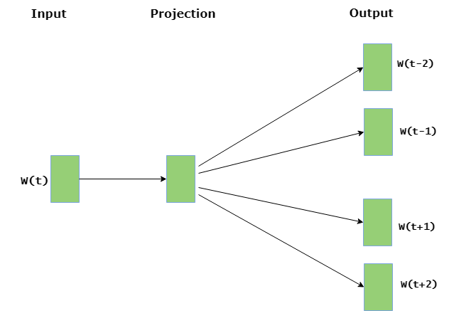

# Word Embedding using Word2Vec

**Word Embedding** is a language modeling technique used for mapping words to vectors of real numbers. It represents words or phrases in vector space with several dimensions. Word embeddings can be generated using various methods like neural networks, co-occurrence matrix, probabilistic models, etc. Word2Vec consists of models for generating word embedding. These models are shallow two-layer neural networks having one input layer, one hidden layer, and one output layer. Word2Vec utilizes two architectures :

- **CBOW (Continuous Bag of Words)**  
  CBOW model predicts the current word given context words within a specific window. The input layer contains the context words and the output layer contains the current word. The hidden layer contains the number of dimensions in which we want to represent the current word present at the output layer.

  

- **Skip Gram**  
  Skip gram predicts the surrounding context words within specific window given current word. The input layer contains the current word and the output layer contains the context words. The hidden layer contains the number of dimensions in which we want to represent current word present at the input layer.

  

The basic idea of word embedding is words that occur in similar context tend to be closer to each other in vector space. For generating word vectors in Python, modules needed are nltk and gensim.
