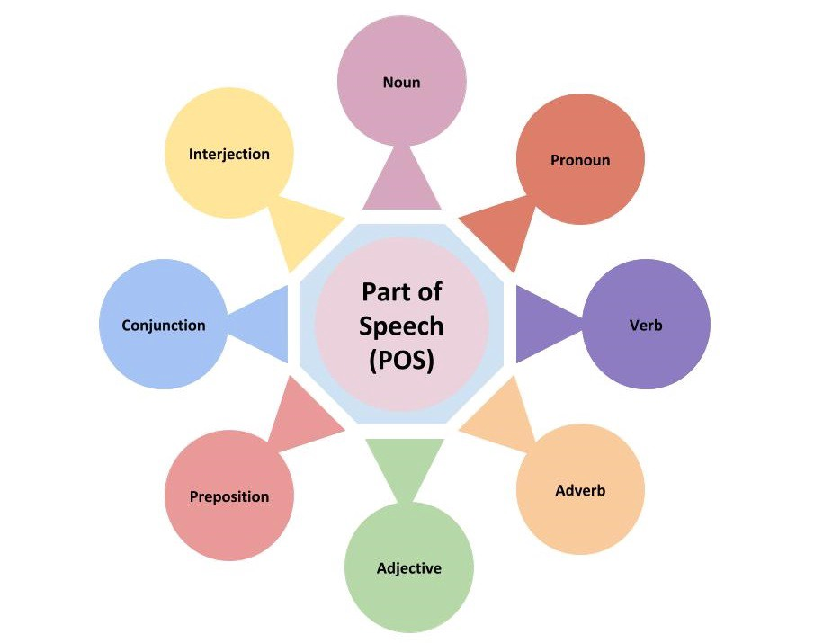
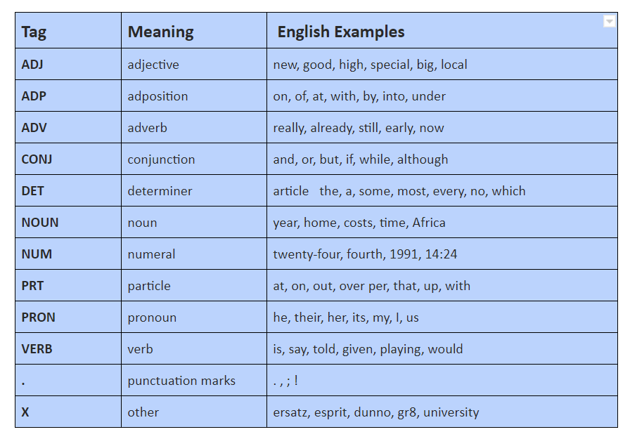

# Natural Langauge Processing || Day6|| POS Tagging

**Part of Speech Tagging** is a process of converting a sentence to forms – list of words, list of tuples (where each tuple is having a form (word, tag)). The tag in case of is a part-of-speech tag, and signifies whether the word is a noun, adjective, verb, and so on.

In natural language, to understand the meaning of any sentence we need to understand the proper structure of the sentence and the relationship between the words available in the given sentence. In NLP, the most basic models are based on the Bag of Words (Bow) approach or technique but such models fail to capture the structure of the sentences and the syntactic relations between words.
To overcome this issue, we need to learn **POS Tagging and Chunking in NLP**.

In traditional grammar, a part of speech (POS) is a category of words that have similar grammatical properties. The part of speech explains how a word is used in a sentence. There are eight parts of speech in the English language: noun, pronoun, verb, adjective, adverb, preposition, conjunction, and interjection.

- Noun (N) — John, London, Table, Teacher, Pen, City, Happiness, Hope
- Pronoun(PRO) — I, We, They, You, He, She, It, Me, Us, Them, Him, Her, This, That
- Verb (V) — Read, Eat, Go, Speak, Run, Play, Live, Have, Like, Are, Is
- Adverb(ADV) — Slowly, Quietly, Very, Always, Never, Too, Well, Tomorrow
- Adjective(ADJ) — Big, Happy, Green, Young, Fun, Crazy, Three
- Preposition (P) — At, On, In, From, With, Near, Between, About, Under
- Conjunction (CON) — And, Or,But, Because, So, Yet, Unless, Since, If
- Interjection (INT) — Ouch! Wow! Great! Help! Oh! Hey! Hi!

The process of classifying words into their parts of speech and labeling them accordingly is known as **POS-tagging**. Parts of speech are also known as word classes or lexical categories. The collection of tags used for a particular task is known as a tagset.
To understand the meaning of any sentence or to extract relationships and build a knowledge graph, POS Tagging is a very important step.

**Universal Part-of-Speech Tagset**

The Universal tagset of NLTK comprises 12 tag classes: Verb, Noun, Pronouns, Adjectives, Adverbs, Adpositions, Conjunctions, Determiners, Cardinal Numbers, Particles, Other/ Foreign words, Punctuations. This dataset has 3,914 tagged sentences and a vocabulary of 12,408 words.

**_POS tagging is a supervised learning solution which aims to assign parts of speech tag to each word of a given text (such as nouns, pronoun, verbs, adjectives, and others) based on its context and definition._**

## How does POS Tagging work?

As per the NLP Pipeline, we start POS Tagging with text normalization after obtaining a text from the source. Text normalization includes:

- Converting Text (all letters) into lower case
- Removing HTML tags
- Expanding contractions
- Converting numbers into words or removing numbers
- Removing special character (punctuations, accent marks and other diacritics)
- Removing white spaces
- Word Tokenization
- Stemming and Lemmatization
- Removing stop words, sparse terms, and particular words

**Once the given text is cleaned and tokenized then we apply pos tagger to tag tokenized words.** 
There are many tools containing POS taggers including NLTK, TextBlob, spaCy, Pattern, Stanford CoreNLP, Memory-Based Shallow Parser (MBSP), Apache OpenNLP, Apache Lucene, General Architecture for Text Engineering (GATE), FreeLing, Illinois Part of Speech Tagger, and DKPro Core.

## The Different POS Tagging Techniques

- **Lexical Based Methods** — Assigns the POS tag the most frequently occurring with a word in the training corpus.
- **Rule-Based Methods** — Assigns POS tags based on rules. For example, we can have a rule that says, words ending with “ed” or “ing” must be assigned to a verb. Rule-Based Techniques can be used along with Lexical Based approaches to allow POS Tagging of words that are not present in the training corpus but are there in the testing data.
- **Probabilistic Methods** — This method assigns the POS tags based on the probability of a particular tag sequence occurring. Conditional Random Fields (CRFs) and Hidden Markov Models (HMMs) are probabilistic approaches to assign a POS Tag.
- **Deep Learning Methods** — Recurrent Neural Networks can also be used for POS tagging.
